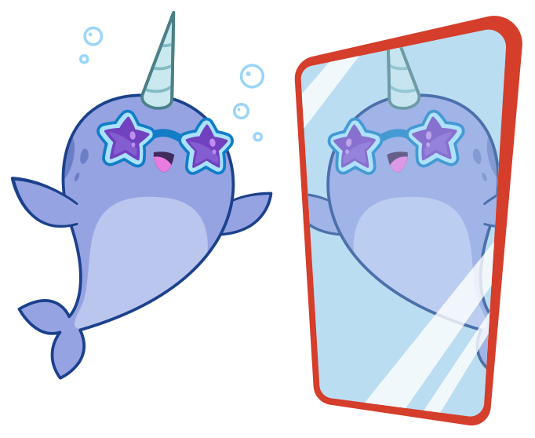

# Nellie's Photo Album

Collection of artworks used by the [`webhint`][webhint site] project.

Nellie was originally created by [Stephanie Drescher][stephanie
drescher]. Artworks are by [Mike Bonales][mike bonales].

## Logo

<table>
    <tbody>
        <tr height=250>
            <td></td>
        </tr>
    </tbody>
</table>

## Nellie

### Nellie confused

<table>
    <tbody>
        <tr height=250>
            <td></td>
        </tr>
    </tbody>
</table>

### Nellie developing

<table>
    <tbody>
        <tr height=250>
            <td></td>
        </tr>
    </tbody>
</table>

### Nellie with Octocat

<table>
    <tbody>
        <tr height=250>
            <td></td>
            <td></td>
        </tr>
    </tbody>
</table>

### Nellie searching

<table>
    <tbody>
        <tr height=250>
            <td></td>
        </tr>
    </tbody>
</table>

### Nellie with sunglasses

<table>
    <tbody>
        <tr height=250>
            <td></td>
        </tr>
    </tbody>
</table>

### Nellie swimming

<table>
    <tbody>
        <tr height=250>
            <td></td>
        </tr>
    </tbody>
</table>

## Cities

### Brighton

<table>
    <tbody>
        <tr height=250>
            <td></td>
        </tr>
    </tbody>
</table>

### New York

<table>
    <tbody>
        <tr height=250>
            <td></td>
        </tr>
    </tbody>
</table>

### Orlando

<table>
    <tbody>
        <tr height=250>
            <td></td>
        </tr>
    </tbody>
</table>

### San Francisco

<table>
    <tbody>
        <tr height=250>
            <td></td>
        </tr>
    </tbody>
</table>

### Seattle

<table>
    <tbody>
        <tr height=250>
            <td></td>
        </tr>
    </tbody>
</table>

## License

The artworks are available under the [Creative Commons Attribution 4.0
International license][license].

<!-- Link labels: -->

[license]: LICENSE.txt
[mike bonales]: http://www.mikebonales.com/
[stephanie drescher]: http://stephaniestimac.com/
[webhint site]: https://webhint.io/
